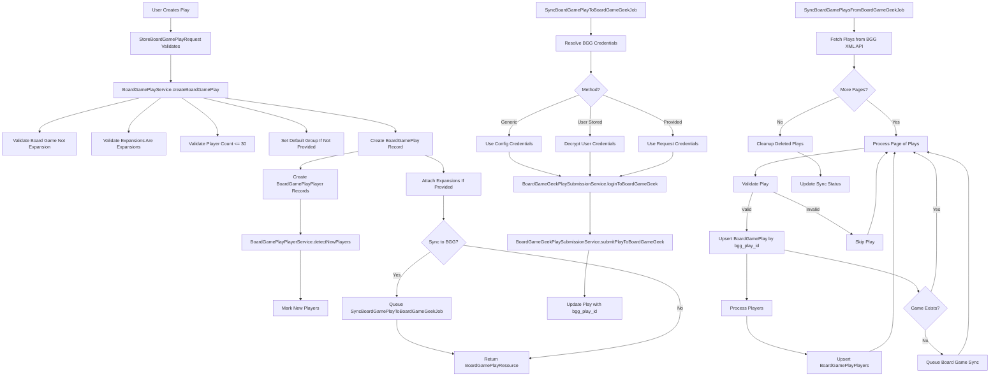

# Plays

Backend Implementation Plan

## Overview

This plan implements a complete Plays backend system for logging board game plays. Each play can be associated with a board game (base game only), optional expansions, a group (or kept separate), and up to 30 players with scores, winner status, and new player detection.

## Architecture

### Database Schema

#### 1. `board_game_plays` table

- `id` (primary key)
- `board_game_id` (foreign key to `board_games`, required) - must reference a base game (not expansion)
- `group_id` (foreign key to `groups`, nullable) - defaults to user's default group
- `created_by_user_id` (foreign key to `users`, required) - user who logged the play
- `played_at` (date, required) - date the boardgame was played
- `location` (string, required) - location where the boardgame was played
- `comment` (text, nullable) - optional lengthy comment
- `game_length_minutes` (integer, nullable) - optional game length in minutes
- `source` (enum: 'website', 'boardgamegeek') - original source of the play
- `bgg_play_id` (string, nullable, unique) - BoardGameGeek play ID if synced from/to BGG
- `bgg_synced_at` (timestamp, nullable) - when synced from BGG
- `bgg_sync_status` (string, nullable) - sync status for incoming syncs
- `bgg_sync_error_message` (text, nullable) - sync error message for incoming syncs
- `bgg_synced_to_at` (timestamp, nullable) - when synced to BGG
- `bgg_sync_to_status` (string, nullable) - sync status for outgoing syncs ('pending', 'synced', 'failed')
- `bgg_sync_to_error_message` (text, nullable) - sync error message for outgoing syncs
- `sync_to_bgg` (boolean, default false) - whether to sync this play to BGG
- `created_at`, `updated_at` (timestamps)
- Indexes: `board_game_id`, `group_id`, `created_by_user_id`, `played_at`, `source`, `bgg_play_id`, `sync_to_bgg`, `bgg_sync_to_status`

#### 2. `board_game_play_players` table

- `id` (primary key)
- `board_game_play_id` (foreign key to `board_game_plays`, cascade delete)
- `user_id` (foreign key to `users`, nullable) - linked user (mutually exclusive with other identifiers)
- `board_game_geek_username` (string, nullable) - BGG username (mutually exclusive with other identifiers)
- `guest_name` (string, nullable) - guest name (mutually exclusive with other identifiers)
- `score` (decimal, nullable) - player's score
- `is_winner` (boolean, default false) - whether player won
- `is_new_player` (boolean, default false) - whether this is player's first play of this boardgame
- `position` (integer, nullable) - player position/rank in the game
- `created_at`, `updated_at` (timestamps)
- Check constraint: exactly one of `user_id`, `board_game_geek_username`, or `guest_name` must be set
- Indexes: `board_game_play_id`, `user_id`, `board_game_geek_username`
- Unique constraint: prevent duplicate players in same play (based on identifier type)

#### 3. `board_game_play_expansions` table (pivot)

- `id` (primary key)
- `board_game_play_id` (foreign key to `board_game_plays`, cascade delete)
- `board_game_id` (foreign key to `board_games`, cascade delete) - must be an expansion
- `created_at`, `updated_at` (timestamps)
- Unique constraint: `(board_game_play_id, board_game_id)`
- Indexes: `board_game_play_id`, `board_game_id`

#### 4. Migration: Add BGG credentials to `users` table

- `board_game_geek_username` (string, nullable) - already exists
- `board_game_geek_password_encrypted` (text, nullable) - encrypted BGG password for user's own credentials
- `sync_plays_to_board_game_geek` (boolean, default false) - whether user wants to sync plays to BGG
- Index: `board_game_geek_username`

### Models

#### `BoardGamePlay` Model

- Relationships:
- `belongsTo(BoardGame)` - the base game
- `belongsTo(Group)` - optional group
- `belongsTo(User)` - creator
- `hasMany(BoardGamePlayPlayer)` - players
- `belongsToMany(BoardGame)` - expansions via pivot table
- Scopes:
- `scopeForGroup(Group $group)` - plays for a specific group
- `scopeForUser(User $user)` - plays created by user
- `scopeForBoardGame(BoardGame $boardGame)` - plays for a board game
- `scopeFromSource(string $source)` - plays from a specific source
- `scopePendingBggSync()` - plays pending sync to BGG
- Methods:
- `isFromBoardGameGeek(): bool` - check if from BGG
- `isSyncedToBoardGameGeek(): bool` - check if synced to BGG
- `getPlayerCount(): int` - get number of players
- `getWinners(): Collection` - get winning players

#### `BoardGamePlayPlayer` Model

- Relationships:
- `belongsTo(BoardGamePlay)`
- `belongsTo(User)` - nullable
- Methods:
- `getPlayerIdentifier(): string` - get display name (user name, BGG username, or guest name)
- `isUserPlayer(): bool` - check if linked to user
- `isBggPlayer(): bool` - check if BGG username
- `isGuestPlayer(): bool` - check if guest

### Services

#### `BoardGamePlayService` (extends `BaseService`)

- `createBoardGamePlay(array $playData, User $user): BoardGamePlay` - create a play with validation
- `updateBoardGamePlay(BoardGamePlay $play, array $playData): BoardGamePlay` - update a play
- `deleteBoardGamePlay(BoardGamePlay $play): bool` - delete a play
- `addPlayerToPlay(BoardGamePlay $play, array $playerData): BoardGamePlayPlayer` - add a player
- `removePlayerFromPlay(BoardGamePlay $play, int $playerId): bool` - remove a player
- `detectNewPlayers(BoardGamePlay $play): void` - auto-detect and mark new players
- `validateBoardGameIsNotExpansion(BoardGame $boardGame): void` - ensure base game
- `validateExpansionIsExpansion(BoardGame $boardGame): void` - ensure expansion
- `validatePlayerCount(int $count): void` - ensure max 30 players
- `getDefaultGroupForUser(User $user): ?Group` - get user's default group
- `queueBggSyncIfRequested(BoardGamePlay $play, ?string $bggUsername = null, ?string $bggPassword = null): void` - queue BGG sync job if requested

#### `BoardGamePlayPlayerService` (extends `BaseService`)

- `isFirstPlayForPlayer(BoardGame $boardGame, ?User $user, ?string $bggUsername, ?string $guestName): bool` - check if first play
- `resolvePlayerIdentifier(?int $userId, ?string $bggUsername, ?string $guestName): array` - resolve player identifier

#### `BoardGameGeekPlaySubmissionService` (extends `BaseService`)

- `loginToBoardGameGeek(string $username, string $password): array` - authenticate with BGG API, returns session/cookie data
- `submitPlayToBoardGameGeek(BoardGamePlay $play, array $credentials, ?string $bggPlayId = null): array` - submit play to BGG, returns BGG play ID
- `mapPlayToBoardGameGeekFormat(BoardGamePlay $play): array` - convert play data to BGG API format
- `mapPlayerToBoardGameGeekFormat(BoardGamePlayPlayer $player, int $index): array` - convert player data to BGG format
- `getBggCredentialsForPlay(BoardGamePlay $play, ?string $providedUsername = null, ?string $providedPassword = null): array` - resolve credentials using three methods (config, user stored, provided)
- `handleBggSubmissionError(\Exception $exception, BoardGamePlay $play): void` - handle and log errors

#### `BoardGameGeekPlaySyncService` (extends `BaseService`)

- `fetchPlaysFromBoardGameGeek(string $username, ?string $minDate = null, ?string $maxDate = null): \SimpleXMLElement` - fetch plays XML from BGG API with pagination
- `processBggPlaysXml(\SimpleXMLElement $xml, User $user): array` - process XML and return array of play IDs processed
- `syncPlayFromBggXml(\SimpleXMLElement $playElement, User $user): BoardGamePlay` - sync a single play from BGG XML to database
- `mapBggPlayToDatabase(array $bggPlayData, User $user): array` - map BGG play data to our database format
- `mapBggPlayerToDatabase(array $bggPlayerData, int $playId): array` - map BGG player data to our database format
- `cleanupDeletedBggPlays(User $user, array $bggPlayIds, string $minDate, string $maxDate): void` - delete plays that no longer exist on BGG
- `validateBggPlay(\SimpleXMLElement $playElement): bool` - validate play meets criteria (incomplete=0, nowinstats=0, quantity>0, has players, valid subtype)
- `getBggPlaySubtype(\SimpleXMLElement $playElement): ?string` - extract play subtype from XML
- `syncBoardGameIfNeeded(string $bggGameId): void` - trigger board game sync if game doesn't exist locally

### Controllers

#### `BoardGamePlayController` (extends `BaseApiController`)

- `index(Request $request): JsonResponse` - list plays with filtering/pagination
- `store(StoreBoardGamePlayRequest $request): JsonResponse` - create a play
- `show(Request $request, string $id): JsonResponse` - get a play
- `update(UpdateBoardGamePlayRequest $request, string $id): JsonResponse` - update a play
- `destroy(Request $request, string $id): JsonResponse` - delete a play

### Form Requests

#### `StoreBoardGamePlayRequest`

- Validation rules:
- `board_game_id`: required, exists:board_games,id, must not be expansion
- `group_id`: nullable, exists:groups,id
- `played_at`: required, date
- `location`: required, string, max:255
- `comment`: nullable, string
- `game_length_minutes`: nullable, integer, min:1
- `source`: required, in:website,boardgamegeek
- `expansions`: nullable, array, each expansion must exist and be expansion
- `players`: required, array, min:1, max:30
- `players.*.user_id`: nullable, required_without_all:players.*.board_game_geek_username,players.*.guest_name, exists:users,id
- `players.*.board_game_geek_username`: nullable, required_without_all:players.*.user_id,players.*.guest_name, string, max:255
- `players.*.guest_name`: nullable, required_without_all:players.*.user_id,players.*.board_game_geek_username, string, max:255
- `players.*.score`: nullable, numeric
- `players.*.is_winner`: nullable, boolean
- `players.*.position`: nullable, integer, min:1
- `sync_to_board_game_geek`: nullable, boolean - whether to sync to BGG
- `board_game_geek_username`: nullable, string, max:255 - BGG username if using provided credentials method
- `board_game_geek_password`: nullable, string - BGG password if using provided credentials method (not stored)

#### `UpdateBoardGamePlayRequest`

- Same validation as Store, but all fields optional (except board_game_id if provided must not be expansion)

### Policies

#### `BoardGamePlayPolicy`

- `viewAny(User $user): bool` - authenticated users can view plays
- `view(User $user, BoardGamePlay $play): bool` - users can view plays in their groups or their own plays
- `create(User $user): bool` - authenticated users can create plays
- `update(User $user, BoardGamePlay $play): bool` - users can update their own plays or group admin for group plays
- `delete(User $user, BoardGamePlay $play): bool` - users can delete their own plays or group admin for group plays

### API Resources

#### `BoardGamePlayResource`

- Transform play data with relationships
- Include: board game, group, creator, players, expansions
- Format dates, handle nullable fields

#### `BoardGamePlayPlayerResource`

- Transform player data
- Include player identifier display name

### Background Jobs

#### `SyncBoardGamePlaysFromBoardGameGeekJob`

- Sync plays from BGG API for a user
- Queue with delays to respect rate limits
- Store BGG play ID and sync metadata
- Handle errors gracefully
- **Daily Sync Logic**:
- Fetches plays from last 30 days for users with `board_game_geek_username`
- Uses BGG XML API: `https://boardgamegeek.com/xmlapi2/plays?username={username}&maxdate={maxdate}&mindate={mindate}&page={page}`
- Handles pagination (100 plays per page)
- Processes only valid plays: `incomplete=0`, `nowinstats=0`, `quantity>0`, has players, subtype is `boardgame`/`boardgameexpansion`/`boardgamecompilation`
- Maps BGG XML data to our database structure
- Inserts new plays or updates existing plays by `bgg_play_id`
- Processes players with: username, name, win, new, startposition, color, score, rating
- Cleans up plays that no longer exist on BGG (deletes plays in our DB that aren't in BGG response)
- Triggers board game sync if game doesn't exist locally

#### `SyncBoardGamePlayToBoardGameGeekJob`

- Sync a single play to BGG API
- Queue with delays to respect rate limits
- Use `BoardGameGeekPlaySubmissionService` to submit play
- Handle three authentication methods:

1. Generic credentials from config (`boardgamegeek.generic_username`, `boardgamegeek.generic_password`)
2. User's stored encrypted credentials (`user.board_game_geek_username`, `user.board_game_geek_password_encrypted`)
3. Provided credentials from request (temporary, not stored)

- Update play with `bgg_play_id`, `bgg_synced_to_at`, `bgg_sync_to_status`
- Handle errors and update `bgg_sync_to_error_message`
- Retry logic with exponential backoff

### Factories & Seeders

#### `BoardGamePlayFactory`

- Create test plays with relationships
- Support creating plays with players, expansions

#### `BoardGamePlaySeeder` (optional)

- Seed sample plays for development

### Tests

#### Unit Tests

- `BoardGamePlayTest` - model relationships, scopes, methods
- `BoardGamePlayPlayerTest` - model methods, identifier resolution
- `BoardGamePlayServiceTest` - service methods, validation logic
- `BoardGamePlayPlayerServiceTest` - new player detection logic

#### Feature Tests

- `BoardGamePlayControllerTest` - all CRUD operations
- `BoardGamePlayValidationTest` - validation rules
- `BoardGamePlayAuthorizationTest` - policy enforcement
- `BoardGamePlayNewPlayerDetectionTest` - auto-detection of new players

#### Integration Tests

- `BoardGamePlayDatabaseTest` - database constraints, cascades
- `BoardGamePlayBggSyncTest` - BGG sync job (mocked)

## Implementation Files

### Database Migrations

- `create_board_game_plays_table.php`
- `create_board_game_play_players_table.php`
- `create_board_game_play_expansions_table.php`

### Models

- `app/Models/BoardGamePlay.php`
- `app/Models/BoardGamePlayPlayer.php`

### Services

- `app/Services/BoardGamePlayService.php`
- `app/Services/BoardGamePlayPlayerService.php`
- `app/Services/BoardGameGeekPlaySubmissionService.php`

### Controllers

- `app/Http/Controllers/Api/V1/BoardGamePlayController.php`

### Form Requests

- `app/Http/Requests/BoardGamePlay/StoreBoardGamePlayRequest.php`
- `app/Http/Requests/BoardGamePlay/UpdateBoardGamePlayRequest.php`

### Policies

- `app/Policies/BoardGamePlayPolicy.php`

### Resources

- `app/Http/Resources/BoardGamePlayResource.php`
- `app/Http/Resources/BoardGamePlayPlayerResource.php`

### Jobs

- `app/Jobs/SyncBoardGamePlaysFromBoardGameGeekJob.php`
- `app/Jobs/SyncBoardGamePlayToBoardGameGeekJob.php`

### Services

- `app/Services/BoardGameGeekPlaySubmissionService.php`
- `app/Services/BoardGameGeekPlaySyncService.php`

### Console Commands

- `app/Console/Commands/SyncBoardGamePlaysFromBoardGameGeekCommand.php` - scheduled command that runs daily to sync plays for all users with BGG usernames
- Finds all users with `board_game_geek_username` set
- Queues `SyncBoardGamePlaysFromBoardGameGeekJob` for each user with delays to respect rate limits
- Calculates date range: last 30 days (mindate = today - 30 days, maxdate = today)
- Can also be run manually for specific users or date ranges
- Registered in `app/Console/Kernel.php` to run daily (e.g., `$schedule->command('bgg:sync-plays')->dailyAt('04:00')`)

### Factories

- `database/factories/BoardGamePlayFactory.php`
- `database/factories/BoardGamePlayPlayerFactory.php`

### Tests

- `tests/Unit/Models/BoardGamePlayTest.php`
- `tests/Unit/Models/BoardGamePlayPlayerTest.php`
- `tests/Unit/Services/BoardGamePlayServiceTest.php`
- `tests/Unit/Services/BoardGamePlayPlayerServiceTest.php`
- `tests/Feature/Api/V1/BoardGamePlayControllerTest.php`
- `tests/Feature/BoardGamePlayValidationTest.php`
- `tests/Feature/BoardGamePlayAuthorizationTest.php`
- `tests/Feature/BoardGamePlayNewPlayerDetectionTest.php`
- `tests/Integration/BoardGamePlayDatabaseTest.php`
- `tests/Integration/BoardGamePlayBggSyncTest.php`

### Routes

- Add routes to `routes/api.php`:
- `GET /api/v1/board-game-plays` - list plays
- `POST /api/v1/board-game-plays` - create play
- `GET /api/v1/board-game-plays/{id}` - get play
- `PUT/PATCH /api/v1/board-game-plays/{id}` - update play
- `DELETE /api/v1/board-game-plays/{id}` - delete play

## Key Business Logic

1. **New Player Detection**: When creating/updating a play, check if each player (by user_id, bgg_username, or guest_name) has any previous plays for the same board game. If not, mark `is_new_player = true`.
2. **Default Group Assignment**: If `group_id` is not provided, use the user's `default_group_id`. If user has no default group, allow `group_id` to be null (separate play).
3. **Board Game Validation**: Ensure the base game is not an expansion (`is_expansion = false`). Ensure all expansions in the `expansions` array have `is_expansion = true`.
4. **Player Identifier Mutually Exclusive**: Database check constraint ensures exactly one of `user_id`, `board_game_geek_username`, or `guest_name` is set.
5. **BGG Sync FROM**: 

- **Daily Scheduled Sync**: Command runs daily via Laravel Scheduler to sync plays for all users with `board_game_geek_username`
- **Date Range**: Syncs plays from last 30 days (mindate = today - 30 days, maxdate = today)
- **Pagination**: Handles BGG's pagination (100 plays per page) by looping until no more plays
- **Play Validation**: Only processes valid plays:
    - `incomplete = 0` (play is complete)
    - `nowinstats = 0` (play counts in stats)
    - `quantity > 0` (at least 1 play)
    - Has at least 1 player
    - Subtype is `boardgame`, `boardgameexpansion`, or `boardgamecompilation`
- **Upsert Logic**: Inserts new plays or updates existing plays by `bgg_play_id` (unique identifier)
- **Player Mapping**: Maps BGG player data:
    - `username` → `board_game_geek_username` (if exists)
    - `name` → `guest_name` (if username is empty)
    - `win` → `is_winner`
    - `new` → `is_new_player`
    - `score` → `score` (sanitized, converts comma to dot)
    - `startposition` → `position`
    - `color` and `rating` stored but not currently used in our schema
- **Cleanup**: After sync, deletes plays from our database that no longer exist on BGG (for the date range)
- **Board Game Sync**: Triggers board game sync job if game doesn't exist locally
- **Rate Limiting**: Respects BGG rate limits with delays between requests

6. **BGG Sync TO**: When a play is created with `sync_to_board_game_geek = true`, queue a background job to sync it to BGG. Three authentication methods:

- **Method 1 (Generic)**: Use credentials from `config('boardgamegeek.generic_username')` and `config('boardgamegeek.generic_password')`
- **Method 2 (User Stored)**: Use user's `board_game_geek_username` and decrypted `board_game_geek_password_encrypted` (requires `sync_plays_to_board_game_geek = true`)
- **Method 3 (Provided)**: Use credentials provided in request (`board_game_geek_username`, `board_game_geek_password`) - not stored, used only for this sync

7. **BGG Play Submission Format**: Map play data to BGG's expected format:

- Login via POST to `https://boardgamegeek.com/login/api/v1` with JSON: `{"credentials": {"username": "...", "password": "..."}}`
- Submit play via POST to `https://boardgamegeek.com/geekplay.php` with form data:
    - `ajax=1`, `action=save`, `objecttype=thing`, `objectid={bgg_id}`, `playdate={date}`, `location={location}`, `quantity=1`, `comments={comment}`, `length={minutes}`
    - Players array: `players[0][name]`, `players[0][username]`, `players[0][score]`, `players[0][new]`, `players[0][win]` (up to 30 players)
- Response contains `playid` on success

8. **Password Encryption**: User's BGG password stored encrypted using Laravel's `Crypt::encrypt()` / `Crypt::decrypt()`

## Data Flow

## Notes

- All database operations should use transactions
- Follow existing patterns from GroupController and GroupService
- Use descriptive, full names for all classes, methods, and variables
- Write comprehensive tests before or alongside implementation
- Mock BGG API calls in all tests
- **BGG Password Security**: User passwords must be encrypted using Laravel's `Crypt` facade. Never store plain text passwords.
- **BGG Rate Limiting**: Respect BGG's rate limits (1 request per second). Use job delays and queue spacing.
- **BGG API Format**: BGG login expects JSON, play submission expects form-encoded data. Use appropriate HTTP client methods.
- **Error Handling**: BGG API calls can fail. Always handle errors gracefully, log them, and update play sync status.
- **Cookie Management**: BGG login returns session cookies. Store and reuse cookies for play submission in the same job execution.
- **Player Mapping (TO BGG)**: Map our player data to BGG format:
- User players: use `board_game_geek_username` if available, otherwise use user's name as `name` and username as `username`
- BGG username players: use as `username`, `name` can be same or empty
- Guest players: use `guest_name` as `name`, `username` empty
- Map `is_new_player` to `new` (1 or 0)
- Map `is_winner` to `win` (1 or 0)
- Map `score` directly
- **Player Mapping (FROM BGG)**: Map BGG XML player data to our database:
- If `username` exists: set `board_game_geek_username`, `user_id` = null, `guest_name` = null
- If `username` is empty: set `guest_name` = `name`, `user_id` = null, `board_game_geek_username` = null
- Map `win` (1/0) → `is_winner` (boolean)
- Map `new` (1/0) → `is_new_player` (boolean)
- Map `score` (sanitized, comma→dot) → `score` (decimal)
- Map `startposition` → `position` (integer)
- Note: `color` and `rating` from BGG are not stored in our current schema